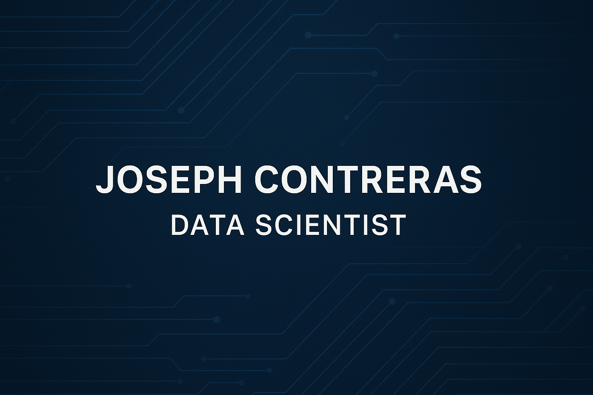

  

<h1 align="center">Hi, I'm <strong>Joseph Contreras</strong> 👋</h1>
<h3 align="center">Data Analyst • Aspiring Data Scientist • Storytelling With Data</h3>

  

---

## 🧑‍💻 About Me

I’m a data analyst with a strong background in operations and leadership, transitioning into data science through TripleTen.

I specialize in analyzing complex datasets, building predictive models, and uncovering insights that drive real business decisions. My experience managing high volume operations has shaped my ability to think critically, solve problems under pressure, and communicate insights clearly to stakeholders.

🔍 What I bring:
• Data analysis & forecasting (Python, Pandas, SQL)
• Machine learning & predictive modeling (Scikit-learn)
• Business-focused insights from real-world datasets
• Strong leadership & communication from 10+ years in management

I’m passionate about using data to improve decision making in industries like sports, retail, and telecom.

Fun Fact:

My background in management and customer facing work shaped my strengths in communication, teamwork, and problem solving skills I now bring into my analytics and data science work.

- 🎓 TripleTen Data Science Graduate  
- 📊 Experienced in EDA, forecasting, A/B testing, and visualization  
- 💬 Strong communication + leadership background (10+ years)  
- 🎮 Passionate about analytics in gaming, telecom, sports, and retail  

---

## 🛠️ Tech Stack & Tools

  
  
  
  
  
  
  
  
  

---
## Core Skills:
• Data Analysis: Pandas, NumPy, SQL
• Visualization: Matplotlib, Seaborn, Tableau
• Machine Learning: Scikit-learn
• Tools: Git, Jupyter Notebook

## 📂 Featured Projects

### 🎮📊 **Video Game Sales Forecasting**
• Built a predictive model to forecast global video game sales using historical data
• Identified top-performing genres and regional trends impacting revenue
• Achieved 50% improvement over baseline model
• Tools: Python, Pandas, Matplotlib, Scikit-learn
🔗 Repo: **[Video-Game-Sales-Forecasting](https://github.com/ContrerasJJ/Video-Game-Sales-Forecasting)**

---

### 📱 **Megaline Telecom User Behavior Analysis**
Analyzed customer usage, plan profitability & churn trends; includes A/B testing.  
🔗 Repo: **[Megaline-Telecom-Analysis](https://github.com/ContrerasJJ/Megaline-Telecom-Analysis)**

---

### 🛒 **Instacart EDA – Customer Shopping Behavior**
EDA project using Instacart data: order patterns, peak times, and product trends.  
🔗 Repo: **[Instacart-EDA-Analysis](https://github.com/ContrerasJJ/Instacart-EDA-Analysis)**

---

### 📺 **IMDb TV Show Ratings & Engagement Study**
Explored how vote count and ratings correlate; analyzed genres & audience behavior.  
🔗 Repo: **[IMDb-TV-Show-Analysis](https://github.com/ContrerasJJ/IMDb-TV-Show-Analysis)**

---

## 📈 GitHub Stats

  
  

---

## 🔥 Most Used Languages

  

---

## 📫 Connect With Me

  
  

---

### ⭐ If you like my work, feel free to star my repositories or connect with me!
